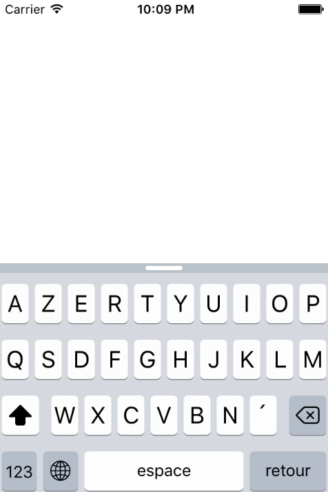

# EmojiParser-iOS

EmojiParser is simple Swift (2.2) extension to UITextView class. It adds two function allowing you to parse the TextView in order to replace Emoji characters such like ":-)" by "😊".



## Installation

Just include the FTEmojiParser in your XCode project and you'll we automatically get the extention in your code.

## Usage

### Functions 
You have two functions that you can use :

```swift
func postParseStringForEmoji() -> String
func lastParseStringForEmoji() -> String
``` 

You can call those functions directly on a UITextView object since it is an extension. The first one will return the parsed string from the ```text``` attribute of the ```textField``` object. The second one is a more optimized function that you could use if you parse without waiting for the user to end his/her sentence.

### Delegate

The best thing to do I guess, is to use it into the delegate of the UITextView. For instance you can use it as follow : 

```swift
func textView(textView: UITextView, shouldChangeTextInRange range: NSRange, replacementText text: String) -> Bool{
	let customTriggerPonctuationSet = ";.?,! "
   		if customTriggerPonctuationSet.containsString(text){
       		self.textView.text = self.textView.lastParseStringForEmoji()
    	}
    return true
}
```

Hence, when a new character is added to the ```textView``` the method will be called and you'll be parsing only the lastest characters. The parsing function will called either after a ";" or a "." or whatever characters included in the ```customTriggerPonctuationSet```string.

If you want to parse at the very end you can call ```postParseStringForEmoji``` in the ```didEndEditing``` delegate method.

### Table

The parser use a table to associate characters to Emoji. If you want to, you can add your own (characters, emoji) tuple and the algorithm will still work. Here is a current table (based on Facebook Emoji) :

```swift
let tables:[String:String] = [
    ":)" : "😊",
    ";)" : "😉",
    ":D" : "😃",
    ":(" : "😞",
    ":/" : "🙁",
    ":$" : "😳",
    ":P" : "😜",
    ":*" : "😘",
    "<3" : "❤️",
    ":O" : "😮",
    "(y)" : "👍🏼",
    "3:)" : "😈",
    "-_-" : "😑",
    ":-*" : "😘",
    ":'(" : "😢",
    ":-)" : "😊",
    ";-)" : "😉",
    "O:)" : "😇",
    ":poop:" : "💩"
]
```

## Example

I've provided a project example. The extension is in FTEmojiParser. The project is a simple UITextView. When you type in your text will be transformed in "text with Emoji".